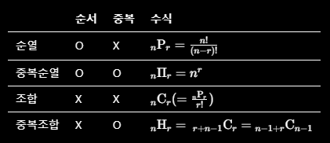

# Permutation & Combination
---
## Intro




```python
n = 3
r = 2

permutation = [1, 2], [1, 3], [2, 1], [2, 3], [3, 1], [3, 2]
permutation_repetition = [1, 1], [1, 2], [1, 3], [2, 1], [2, 2], [2, 3], [3, 1], [3, 2], [3, 3]
combination = [1, 2], [1, 3], [2, 3]
combination_repetition = [1, 1], [1, 2], [1 ,3], [2, 2], [2, 3], [3 ,3]
```


## Permutation
<br>

순열은 순서가 부여된 임의의 집합을 다른 순서로 뒤섞는 연산이다. 순열의 수는 다음과 같이 나타낸다.

n개의 원소에서 r개를 순서에 상관있게 뽑는 경우의 수는 다음과 같다.

$$
\begin{align}

nPr & = {n! \over (n - r)!} \\
& = n(n-1)...(n-r+1)
    
\end{align}
$$

우리의 주 관심사는 알고리즘 문제에서 탐색해야하는 Case, 즉 순열군을 구하는데 있다. Brute Froce와 밀접하며, 그렇기 때문에 Pruning을 염두해 두어야한다. 

내장 함수 `itertools` 를 쓰면 참 편하지만, 문제의 요구사항에 맞게 구현해야 될 수도 있기 때문에(시간 복잡도), 직접 구현해 보자.


총 3개의 집합에서 2개를 순서있게 뽑을 때, 

permutation1은,
1. 3개 중에 1개를 뽑고,
2. 나머지 2개 중에 1개를 뽑고,
3. 마지막 1개를 고르면 된다.

permutation는, 한 자리씩 선택을 하는데 후보군을 줄여 나간다.
1. 1번째 자리에 넣을놈 (본인 포함 index 1 ~ 3중 선택) 선택 후 교환.
2. 2번째 자리와 바꿀 놈(index 2 ~ 3)
3. 3번째 자리와 바꿀 놈(index 3)

첫 번째 방법내 for 문에서 choose[i] = 1인 곳도 확인을 하기 때문에 loss가 발생한다. 따라서 남은 후보 집합을 따로 관리하거나 두 번째 방법을 사용하면 시간을 줄일 수 있다.

$n^2$ -> $n(n-1) \over 2$


```python
n, r = 3, 2
arr = [1, 2, 3]
choose = [0] * n
ans = [0] * r

def permutation1(idx):
    if idx == r:
        print(ans)
    else:
        for i in range(n):
            if not choose[i]:
                ans[idx] = arr[i]
                choose[i] = 1
                permutation1(idx + 1)
                ans[idx] = 0          # 없어도 된다.
                choose[i] = 0

def permutation2(idx):
    if idx == r:
        print(arr[:r])
    else:
        for i in range(idx, n): # 범위 주의 
            arr[idx], arr[i] = arr[i], arr[idx]
            permutation2(idx + 1)
            arr[idx], arr[i] = arr[i], arr[idx]

permutation1(0)            
permutation2(0)
```
---
## Permutation(with repitation)

원소 관점에서 벗어나 담는 상자 (리스트의 동간)입장에서 보면 중복 순열을 이해할 수 있다.

- 서로 다른 편지 4통을 서로 다른 2개의 우체통에 넣기
- 5명의 여행자가 3곳의 호텔에 투숙하는 방법.


n개의 원소에서 r개를 순서에 상관없이 중복해서 뽑는 경우의 수는 다음과 같다.

$$
n\Pi r = n^r
$$

중복 순열의 경우 permutation1에서 choose를 기억할 필요가 없다.
위 첫번 째 수식에서 choose 부분만 제외 시키면 구현된다.(if 검증부도 제거)

yield를 사용하면 간편하게 구현할 수 있다.

```python 
n, r = 3, 2
arr = [1, 2, 3]

def perm_repetition(r):
    for i in range(n):
        if r == 1:
            yield arr[i]
        else:
            for choose in perm_repetition(r - 1):
                yield [arr[i]] + [choose]

for p in perm_repetition(r):
    print(p)

```

---

## Combination
<br>

조합은 유한 개의 원소에서 주어진 수만큼의 원소들을 고르는 방법이다. 조합의 수는 이항 계수로 주어진다.

n개의 원소에서 r개를 순서에 상관없이 뽑는 경우의 수는 다음과 같다.

$$
\begin{align}

\binom{n}{r} = nCr & = {n! \over r!(n - r)!} \\
& = {nPr \over r!}
    
\end{align}
$$

조합 역시 내장 패키지 itertools를 사용할 수 있으나, pruning을 염두해 두어 직접구현을 권장한다.


조합 역시 다양한 방법으로 구현이 가능한데, 순서를 신경 쓰지 않아도 되기 때문에 각 요소를 선택할지 판단만 하면 된다.

cur 변수는 n 범위 내에서 순회하며, idx 변수는 조합에 포함시킬 변수를 의미한다.

arr의 각 원소를 선택할지 말지 판단하며, 선택한 조합내 원소의 개수가 r개를 만족시키면 반환한다.

combination2는 itertools 패키지의 방식을 재구성해본 건데, 조합이라는게 분할 정복 방식으로 생각이 가능하다. 원소 하나를 골랐다면, 나머지 원소들 중 고를 놈을 골라나가는 방식. 

보다 컴팩트하게 구현됬지만 가지치기가 까다로워 보인다. 


```python
n, r = 3, 2
arr = [1, 2, 3]
ans = [0] * r

def nCr(c, r, s):
    if r == 0:
        print(ans)
    else:
        for i in range(s, n - r + 1):
            ans[r-1] = arr[i]
            nCr(n, r-1, i+1)


def combination1(idx, cur):
    if cur == n and idx != r: return # 돌았는데 다 선택 못한 경우.

    if idx == r:
        print(ans)
        return      # 다 선택했으면, n번 까지 돌 필요가 없다.
    else:
        ans[idx] = arr[cur]
        combination1(idx + 1, cur + 1)
        ans[idx] = 0
        combination1(idx, cur + 1)

def combination2(arr, r):
    if r == 0: return [[]]
    l = []
    for i in range(len(arr)):
        rest = combination2(arr[i + 1:] , r - 1)
        for p in rest:
            l.append([arr[i]] + p)
    return l

nCr(n, r, 0)
combination1(0, 0)
print(combination2(arr, r))

```

---

## Combination(with repitation)


combination2를 이해했다면 중복 조합을 표현하기 매우 편리해 진다. 나머지 조합을 arr[i + 1:] 로 넘겨주던 것을 arr[i:]로 후보군에 본인을 포함시키면 되기 때문이다.
```python
def comb_repetition(arr, r):
    if r == 0: return [[]]
    l = []
    for i in range(len(arr)):
        rest = comb_repetition(arr[i:] , r - 1) # 이 부분만 바뀜
        for p in rest:
            l.append([arr[i]] + p)
    return l

```
