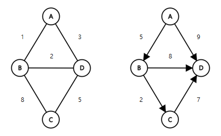
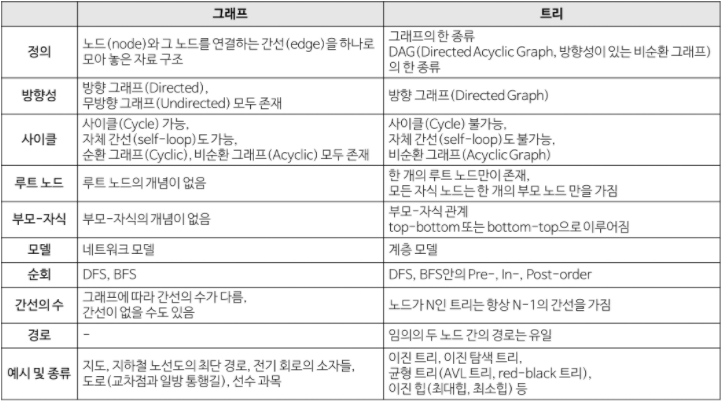
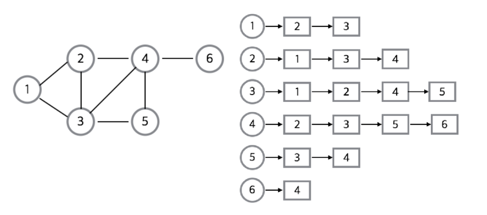

# Graph

그래프는 정점(Vertex)과 간선(Edge)로 이루어진 자료구조이다.


- 그래프 용어

<center>

|명칭 | 내용|
|---|---|
|정점(Vertex)|노드(node) 라고도 하며 정점에는 데이터가 저장된다.|
|간선(Edge)|정점(노드)를 연결하는 선으로 link, branch 라고도 부른다.|
|인접 정점(adjacent Vertex)|간선에 의해 직접 연결된 정점|
|단순 경로(simple path)|경로 중에서 반복되는 정점이 없는 경우.|
|차수(degree)|무방향 그래프에서 하나의 정점에 인접한 정점의 수|
|진출 차수(in-degree)|방향 그래프에서 외부로 향하는 간선의 수|
|진입 차수(out-degree)|방향 그래프에서 외부에서 들어오는 간선의 수|
|경로 길이(path length)|경로를 구성하는데 사용된 간선의 수|
|사이클(cycle)|단순 경로의 시작 정점과 종료 정점이 동일한 경우|
</center> 

- 그래프 종류

간선 방향의 유무, 간선 가중치의 유무, 사이클의 유무, 단절 여부에 따라 다양하게 구분할 수 있다. 모든 정점이 연결되어 있는 경우 완전 그래프라고 부른다. 




앞서 다룬 트리 자료구조는 그래프의 일종이라고 할 수 있다.




- 구현 

구현은 인접 리스트(Adjacency List), 인접 행렬(Adjacency Matrix)2가지로 할 수 있다. 

1. 인접 리스트


    각 정점에 대해 연결된 정점을 인접 리스트로 만들고, 이 인접리스트를 리스트로 표현. 연결된 정점만 기록한다는 특징이 있다.

    - 메모리 낭비가 적다.
    - 인접 노드 순회가 용이하다.
    - 간선 정보 확인시 O(N = 간선 수)  -> 불필요한 탐색시간 발생가능.
    
- 간선이 적으면 유리하다.

<br><br>

2. 인접 행렬


    2차원 배열로 그래프를 표현한다. matrix[i][j]는 i, j의 연결 여부(0/1)나, 가중치로 표현 가능하다. 

    - 간선 정보 확인이 매우 용이하다. O(1)
    - 메모리가 필요 이상으로 사용 될 수 있다.
    - 생성시 오래 걸린다.
- 간선이 Dense하게 주어질 때 용이하다.

---
- 예제 코드

```python
n = 4
e = 5
nodes = [[2, 1], [2, 4], [1, 4], [2, 3], [3, 4]]

#인접 리스트
adj_list = [[] for _ in range(n)]
for src, dst in nodes:
    adj_list[src-1].append(dst-1)
    adj_list[dst-1].append(src-1)

#인접 행렬
adj_matrix = [[0 for _ in range(n)] for _ in range(n)]
for src, dst in nodes:
    adj_matrix[src-1][dst-1] = 1
    adj_matrix[dst-1][src-1] = 1

```