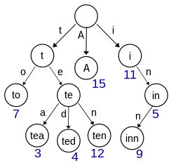

# Trie




트라이(Trie)는 트리 자료구조 중 하나로, Digital Tree, Retrieval Tree, Prefix Tree 라고 불린다. 문자열을 저장하고 탐색하기 용이한 구조로 특징은 다음과 같다.

- Binary Tree와 달리 여러 갈래로 나뉘는 M-way tree이다. 

- 문자열(단어)의 각 문자가 노드가 되며, 접두어를 공유할 수 있다.

    - ex) hello 와 hey는 he 노드를 공유한다.
<br><br>

- 문자열의 길이를 L, 문자열의 개수를 N이라고 하면 다음과 같은 복잡도는 가진다. 

<center>

|연산|시간 복잡도|공간 복잡도|
|------|---|---|
|삽입|O(L)|O(N*L)|
|탐색|O(L)|O(1)|
</center> 

---
- 예제 코드

```python
class Trie:
    head = {}
    def add(self, word):        
        cur = self.head
        for ch in word:         
            if ch not in cur:
                cur[ch] = {}
            cur = cur[ch]
        cur['*'] = True
    
    def search(self, word):
        cur = self.head

        for ch in word:
            if ch not in cur:
                return False
            cur = cur[ch]
        if '*' in cur:
            return True
        else:
            return False
tr1 = Trie()
tr1.add("affa")
tr1.add("af")
print(tr1.search("af"))
```


```python
class Node:
   def __init__(self):
       self.children = {}  
       self.value = None

def find(node, key):
  for char in key:
    if char in node.children:
      node = node.children[char]
    else:
      return None
  return node.value

def insert(node, key, value) -> None:
    for char in key:
        if char not in node.children:
            node.children[char] = Node()
        node = node.children[char]
    node.value = value

tr2 = Node()
g = 1
insert(tr2, "asd", 4264)
print(find(tr2, "asd"))
```