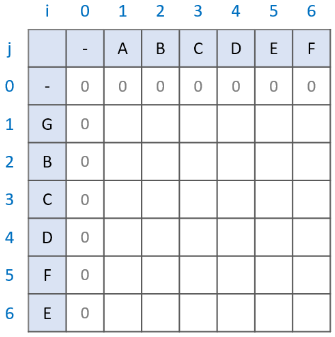

# LCS : Longest Common Subsequence

# 최장 공통 부분 수열

`두 수열이 주어졌을 때, 모두의 부분 수열이 되는 수열 중 **가장 긴 것**을 찾는 알고리즘`

- 주로 **최장 공통 부분 수열**(Longest Common Subsequence)을 말하지만, **최장 공통 문자열**(Longest Common Substring)을 말하기도 한다
- ex) ABCDEF & GBCDFE
    - Longest Common Subsequence : BCDF or BCDE (부분수열이기 때문에 문자 사이를 건너뛰어 공통되면서 가장 긴 부분 문자열)
    - Longest Common Substing : BCD (한번에 이어져있는 문자열만 가능)

---

# 최장 공통 문자열(Longest Common Substring)

- 점화식

```python
if i == 0 or j == 0:  # 마진 설정
	LCS[i][j] = 0
elif string_A[i] == string_B[j]:
	LCS[i][j] = LCS[i - 1][j - 1] + 1
else:
	LCS[i][j] = 0
```

- LCS라는 2차원 배열을 이용하여 두 문자열을 행, 열에 매칭
- 편의상 i, j가 0일 때는 모두 0을 넣어줘 마진값을 설정
- 이후, i, j가 1 이상일 때부터 검사를  시작
    1. 문자열 A, 문자열 B의 한 글자씩 비교
    2. 두 문자가 **다르다면** `LCS[i][j]` 에 `0` 을 표시
    3. 두 문자가 **같다면** `LCS[i-1][j-1]` 값을 찾아 `+1` 
    4. 1, 2, 3 반복
- 공통 문자열은 연속 되어야 함!
- 두 문자의 앞 글자까지가 공통 문자열 이라면 계속 공통 문자열이 이어질 것
- 아니라면 본인부터 다시 공통 문자열을 만들어 가게 될 것

## 구현 과정



1. 앞 마진이 0인 2차원 배열을 생성, ABCDEF 문자열과 GBCDFE 문자열을 한 글자 씩 비교


1. G를 ABCDEF와 한 글자 씩 비교, 같은 문자가 없기 때문에 `LCS[i][j]` 값은 모두 0으로 채워짐


1. 다음으로 B를 ABCDEF와 한 글자 씩 비교, 같은 문자가 존재하면 `LCS[i][j]` 값은 `LCS[i-1][j-1] + 1` 
    - `LCS[1][1] = 0`
    - `LCS[2][2] = 0 + 1 = 1`
    


1. 다음으로 C를 ABCDEF와 한 글자 씩 비교, 같은 문자가 존재하면 `LCS[i][j]` 값은 `LCS[i-1][j-1] + 1` 
    - `LCS[2][2] = 1`
    - `LCS[3][3] = 1 + 1 = 2`


1. 다음으로 D를 ABCDEF와 한 글자 씩 비교, 같은 문자가 존재하면 `LCS[i][j]` 값은 `LCS[i-1][j-1] + 1` 
    - `LCS[3][3] = 2`
    - `LCS[4][4] = 2 + 1 = 3`


1. 다음으로 F를 ABCDEF와 한 글자 씩 비교, 같은 문자가 존재하면 `LCS[i][j]` 값은 `LCS[i-1][j-1] + 1` 
    - `LCS[4][5] = 0`
    - `LCS[5][6] = 0 + 1 = 1`
    - (i가 가로축, j가 세로축임에 유의)


1. 다음으로 E를 ABCDEF와 한 글자 씩 비교, 같은 문자가 존재하면 `LCS[i][j]` 값은 `LCS[i-1][j-1] + 1` 
    - `LCS[4][5] = 0`
    - `LCS[5][6] = 0 + 1 = 1`
    - (i가 가로축, j가 세로축임에 유의)
    


1. 최댓값을 찾으면 Longest Common Substring 종료

---

# 최장 공통 부분수열(Longest Common Subsequence) 길이 구하기

- 점화식

```python
if i == 0 or j == 0:  # 마진 설정
	LCS[i][j] = 0
elif string_A[i] == string_B[j]:
	LCS[i][j] = LCS[i - 1][j - 1] + 1
else:
	LCS[i][j] = max(LCS[i - 1][j], LCS[i][j - 1])
```

- 위와 마찬가지로 LCS라는 2차원 배열에 매칭하고 마진값을 설정한 후 검사
    1. 문자열 A, 문자열 B의 한 글자씩 비교
    2. 두 문자가 다르다면 `LCS[i-1][j]` 와 `LCS[i][j-1]` 중에 큰 값을 표시
    3. 두 문자가 같다면 `LCS[i-1][j-1]` 값을 찾아 `+1` 
    4. 1, 2, 3 반복

최장 공통 문자열을 구하는 과정과 다른부분은 **비교하는 두 문자가 다를 때**

### 1. `LCS[i-1][j]` 와 `LCS[i][j-1]`

- **부분 수열은 연속된 값이 아님 →** 현재의 문자를 비교하는 과정 이전의 LCS는 **계속해서 유지.**
    
    현재의 문자를 비교하는 과정 이전의 과정이 `LCS[i-1][j]` 와 `LCS[i][j-1]`
    


ex) 문자열 AB와 GBC를 비교하는 과정

- AB와 GBC의 최대 공통 부분 수열이 B라는 것을 알기 위해서는 문자열 A와 GBC를 비교하는 과정, 문자열 AB와 GB를 비교하는 과정이 필요.
- 문자열 AB와 GB의 비교 과정에서 최대 공통 부분수열이 B임을 확인했기 때문에 문자열 AB와 GBC의 최대 공통 부분 수열 역시 B가 됨.


### 2. 왜 문자가 같으면 `LCS[i][j] = LCS[i - 1][j - 1] + 1` ?

- 두 문자가 같은 상황이 오면 지금까지의 최대 공통 부분 수열에 1을 더해주는 것


ex) 문자열 ABC와 GBC를 비교하는 과정

- LCS 배열은 `LCS[i-1][j]` 와 `LCS[i][j-1]` 의 비교를 통해 언제나 본인까지의 최대 공통 부분 수열 값을 갖고 있음
- 문자열 AB와 GB를 비교할 때와 문자열 ABC와 GBC를 비교할 때 달라진 점은 두 문자열 모두에 C가 추가된 점
- 때문에 기존의 최대 공통 부분 수열이 B에 C를 더한 BC가 최대 공통 부분 수열이 되는 것


## 구현과정


1. 앞 마진이 0인 2차원 배열을 생성, ABCDEF 문자열과 GBCDFE 문자열을 한 글자 씩 비교


1. G를 ABCDEF와 한 글자 씩 비교, 문자가 같지 않다면 `LCS[i][j]` 값은 `max(LCS[i-1][j], LCS[i][j-1])`


1. 다음으로 B를 ABCDEF와 한 글자 씩 비교, 같은 문자가 존재하면 `LCS[i][j]` 값은 `LCS[i-1][j-1]) + 1` 
    - `LCS[1][1] = 0`
    - `LCS[2][2] = 0 + 1 = 1`


1. 다음으로 C를 ABCDEF와 한 글자 씩 비교, 같은 문자가 존재하면 `LCS[i][j]` 값은 `LCS[i-1][j-1]) + 1` , 문자가 같지 않다면 `LCS[i][j]` 값은 `max(LCS[i-1][j], LCS[i][j-1])`
    - `LCS[2][2] = 1`
    - `LCS[3][3] = 1 + 1 = 2`
    


1. 다음으로 D를 ABCDEF와 한 글자 씩 비교, 같은 문자가 존재하면 `LCS[i][j]` 값은 `LCS[i-1][j-1]) + 1` , 문자가 같지 않다면 `LCS[i][j]` 값은 `max(LCS[i-1][j], LCS[i][j-1])`
    - `LCS[3][3] = 2`
    - `LCS[4][4] = 2 + 1 = 3`
    


1. 다음으로 F를 ABCDEF와 한 글자 씩 비교, 같은 문자가 존재하면 `LCS[i][j]` 값은 `LCS[i-1][j-1]) + 1` , 문자가 같지 않다면 `LCS[i][j]` 값은 `max(LCS[i-1][j], LCS[i][j-1])`
    - `LCS[4][5] = 3`
    - `LCS[5][6] = 3 + 1 = 4`
    


1. 최댓값을 찾으면 Longest Common Subsequence 탐색 종료

---

# 최장 공통 부분수열(Longest Common Subsequence) 찾기

1. LCS 배열의 **가장 마지막 값**에서 시작. 결과값을 저장할 `result` 배열 준비
2. `LCS[i - 1][j]`와 `LCS[i][j - 1]` 중 현재 값과 같은 값을 찾습니다.2-1. 만약 **같은 값이 있다면 해당 값으로 이동**합니다.2-2. 만약 **같은 값이 없다면 `result`배열에 해당 문자를 넣고 `LCS[i -1][j - 1]`로 이동**합니다.
3. 2번 과정을 반복하다가 0으로 이동하게 되면 종료합니다. `result` 배열의 역순이 **LCS** 입니다.

## 구현과정


1. LCS 배열의 가장 마지막 값에서 시작하여 `LCS[i-1][j]` 와 `LCS[i][j-1]` 중 현재 값과 같은 값 찾기
    - `result = [ , , , ]`


1. 값을 찾았으면 해당 값으로 이동, 다시 `LCS[i-1][j]` 와 `LCS[i][j-1]` 중 현재 값과 같은 값 찾기
    - `result = [ , , , ]`
    


1. 현재 값과 같은 값이 없으므로 LCS[i-1][j-1]로 이동, `result` 배열에 해당 문자 추가
    
    다시 `LCS[i-1][j]` 와 `LCS[i][j-1]` 중 현재 값과 같은 값 찾기
    
    - `result = [**F**, , , ]`
    


1. 값을 찾았으면 해당 값으로 이동, 다시 `LCS[i-1][j]` 와 `LCS[i][j-1]` 중 현재 값과 같은 값 찾기
    - `result = [**F**, , , ]`
    


1. 현재 값과 같은 값이 없으므로 LCS[i-1][j-1]로 이동, `result` 배열에 해당 문자 추가
    
    다시 `LCS[i-1][j]` 와 `LCS[i][j-1]` 중 현재 값과 같은 값 찾기
    
    - `result = [**F, D, ,** ]`
    


1. 현재 값과 같은 값이 없으므로 LCS[i-1][j-1]로 이동, `result` 배열에 해당 문자 추가
    
    다시 `LCS[i-1][j]` 와 `LCS[i][j-1]` 중 현재 값과 같은 값 찾기
    
    - `result = [**F, D, C,** ]`
    


1. 현재 값과 같은 값이 없으므로 LCS[i-1][j-1]로 이동, `result` 배열에 해당 문자 추가
    
    0으로 이동했기 때문에 종료하고, 배열을 뒤집으면 LCS 탐색 완료
    
    - `result = [**F, D, C, B**]`