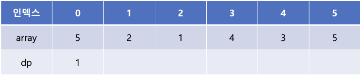

# LIS : Longest Increasing Subsequence

# **최장 증가 부분 수열**

`원소가 n개인 배열의 일부 원소를 골라내서 만든 **부분 수열** 중, 각 원소가 이전 원소보다 크다는 조건을 만족하고, 그 길이가 최대인 부분 수열`

---

## DP를 활용한 LIS



증가 부분 수열의 길이는 1부터 시작


array의 값과 비교했을 때 작으므로 dp[1]에는 1


array[2] 역시 앞의 array 값들과 비교했을 때 작으므로 dp[2]에는 1


array[3]은 array[1]과 array[2]에 비해 큰 값. dp[1]과 dp[2]는 값이 1로 같으므로 dp[3]에는 1(array[1]과 array[2] 중 최댓값) + 1인 2.


array[4]는 array[1]과 array[2]에 비해 큰 값. dp[1]과 dp[2]는 값이 1로 같으므로 dp[3]에는 1 + 1인 2.


마지막 array[5]는 array[1], array[2], array[3], array[4]에 비해 큰 값, dp[3]과 dp[4]가 2로 가장 큰 값이므로 dp[5]에는 2 + 1인 3

```python
array = [5, 2, 1, 4, 3, 5]
dp = [1 for _ in range(len(array))] 

for i in range(1, len(array)):
    for j in range(i): # array의 처음부터 i-1번째 인덱스까지
        if array[i] > array[j]: # 숫자의 크기를 비교하여 현재 값이 더 크면
            dp[i] = max(dp[i], dp[j] + 1) # dp 배열의 값을 더 큰 값으로 갱신
```

수열의 값을 하나씩 비교해가며 길이를 구하기 때문에 O(N^2) → **굉장히 비효율적**

---

## 이분탐색을 활용한 LIS

LIS의 형태를 유지하기 위해 주어진 배열의 인덱스를 하나씩 살펴보면서

**그 숫자가 들어갈 위치를 이분탐색으로 탐색해서 넣는다.**

이분탐색은 일반적으로 시간복잡도가 O(logn)으로 알려져 있으므로, 위의 문제를 O(nlogn)의 시간복잡도로 해결할 수 있게 된다.


1. dp[0]에 1을 넣어주고 x[0]에는 array의 첫 번째 값인 5로 초기화
2. array[1]의 값이 x 배열에서 어디에 들어갈 수 있는지 이분탐색
3. 2는 x 배열의 0번째 인덱스에 들어갈 수 있으며 x[0]에 있는 5보다 작다. 이렇게 해당 인덱스에 있는 x 배열의 값보다 현재 값이 작은 경우 x 배열의 값을 갱신 → **x[0]에 5 대신 2 갱신**
    
    → 길이가 1인 증가 부분 수열이 {5}와 {2}가 있는데 이 수열 중에서 끝 값이 더 작은 2를 x 배열에 저장한다는 뜻
    


이제 array[2]의 값인 1을 살펴보면 역시 x의 0번째에 들어갈 수 있고 이는 현재 x[0]의 값인 2보다 작기 때문에 x[0]을 1로 갱신


array[3]의 값인 4는 x 배열의 마지막 값인 1보다 크므로 새롭게 x 배열에 추가해 줄 수 있다. x[1]에 4를 추가해 주고 dp[1]에는 dp[0] + 1인 2를 넣어줌 → 증가 부분 수열의 길이가 2인 수열 중 끝이 4로 끝나는 수열이 있다는 의미


array[4]의 값인 3은 x 배열에서 1번째 인덱스에 들어갈 수 있으며 현재 x[1]의 값인 4보다 작다. x[1]의 값을 3으로 갱신해 준다. → 증가 부분 수열의 길이가 2인 수열 중 끝이 4와 3인 수열 중 더 작은 값인 3을 x 배열에 저장해 놓는다는 의미


array[5]의 값인 5를 x 배열의 몇 번째에 넣을 수 있는지를 이분탐색을 통해 찾는다. x 배열의 마지막 값인 3보다 크므로 x 배열에 새롭게 5를 추가해 주고 dp 배열에는 dp 배열의 마지막 값에 + 1을 해주어 3을 추가 → 증가 부분 수열의 길이가 3인 수열 중 끝이 5인 수열이 있다는 것을 의미


이렇게 array의 마지막까지 탐색을 끝내고 나면 위와같이 dp 배열과 x 배열이 완성, LIS의 길이는 3

x 배열은 항상 오름차순으로 정렬되어 있기 때문에 array의 값이 x 배열의 어느 위치에 들어갈 수 있는지를 이분 탐색을 활용하여 찾을 수 있으며, Python에서 bisect를 사용하여 쉽게 구현 가능함

```python
from bisect import bisect_left

array = [5, 2, 1, 4, 3, 5]
dp = [1]
x = [array[0]]

for i in range(1, len(array)):
    if array[i] > x[-1]: # 현재 값이 x 배열의 마지막 값보다 클 경우
        x.append(array[i]) # x 배열에 현재 값을 추가해 주고
        dp.append(dp[-1] + 1) # 증가 부분 수열의 길이를 1 증가시킨다.
    else: # 그렇지 않을 경우
        idx = bisect_left(x, array[i]) # 현재 값이 x 배열의 몇 번째 인덱스에 들어갈 수 있는지를 찾아서
        x[idx] = array[i] # x 배열의 idx 위치에 현재 값을 넣어준다.
```

### 참고 - bisect 사용

**`from bisect import bisect, bisect_left, bisect_right`** 를 통해 불러올 수 있다.

- `bisect.bisect(a, x)` : 오름차순으로 정렬된 리스트 'a'에 value 'x'가 삽입 될 가장 오른쪽 index를 리턴한다.
- `bisect.bisect_left(a, x)` : 오름차순으로 정렬된 리스트 'a'에 value 'x'가 삽입 될 가장 왼쪽 index를 리턴한다.
- `bisect.bisect_right(a, x)` : 오름차순으로 정렬된 리스트 'a'에 value 'x'가 삽입 될 가장 오른쪽 index를 리턴한다.
- 가장 오른쪽, 가장 왼쪽을 나누는 이유 : 삽입할 값인 x와 동일한 값이 리스트 a에 이미 존재하는 경우가 있기 때문

---

## **실제 LIS를 구하는 방법????**

1. 각 수가 LIS 배열에 들어갈 때 몇번째 인덱스에 들어가는지를 record라는 리스트에 저장을 한다.
2. 이후에 record가 다 차면 record의 최대값으로부터 역순으로 순회하여 그 인덱스에 해당하는 값을 LIS Result에 저장한다.
3. LIS Result를 오름차순으로 정렬한다.
4. 실제 LIS가 완성된다.


```python
# 전깃줄 - 2 https://www.acmicpc.net/problem/2568

def Lower_Bound(lst, num):
    low = 0
    high = len(lst) - 1
    while (low < high):
        mid = int((low + high) / 2)
        if num <= lst[mid]:
            high = mid
        elif num > lst[mid]:
            low = mid + 1
    return high
 
 
dic = {}
lst = []
lis = [-1]
result = []
backtrace = []
n = int(input())
for i in range(n):
    a, b = map(int, input().split(' '))
    dic[b] = a
temp = sorted(dic)
for i in temp:
    lst.append(dic.get(i))
for i in lst:
    if i > lis[-1]:
        lis.append(i)
    else:
        lis[Lower_Bound(lis, i)] = i
    result.append(lis.index(i)+1)
lisLength = len(lis)
for i in range(len(lst)-1,-1,-1):
    if result[i] == lisLength:
        backtrace.append(lst[i])
        lisLength-=1
print(n - (len(lis) - 1))
lst.sort()
for i in backtrace:
    lst.remove(i)
for i in lst:
    print(i)
```