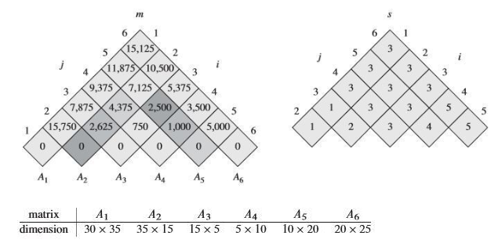

# Matrix Chain Multiplication
---
## Intro

연쇄 행렬 곱셈.

연쇄 행렬 곱셈 문제는 주어진 행렬을 가장 효율적으로 곱하는 방법을 찾는 최적화 문제이다. 

다음 차수를 가진 행렬을 생각해 보자

    A = 2 x 3
    B = 3 x 4
    C = 4 x 5


행렬 곱 (AB)C 와 A(BC)는 곱셈 연산횟수가 다르다.

- (AB)C : 
  - 23 34 행렬 곱 -> 24 행렬
  - 24 45 행렬 곱
  
  2 x 3 x 4 + 2 x 4 x 5 = 64

- A(BC) : 
  - 34 45 행렬 곱 -> 35 행렬
  - 23 35 행렬 곱
  
  3 x 4 x 5 + 2 x 3 x 5 = 90

---

## Brute - force

가령 n 개의 연쇄 행렬 곱을 처리해야 된다고 하자. 


$A_1A_2...A_n$

행열의 곱은 행열이 되므로, 위와 같이 연쇄행열을 곱하는 경우의 수는 괄호로 선행연산을 구분하여 표현하게 된다.

가령 ABCD를 연산하는 경우는 다음과 같고, 

    ((AB)(CD))
    (A((BC)D))
    (((AB)C)D)
    (A(B(CD)))
    ((A(BC))D)
    (A(B(C(D))))
    (((A(B))C)D)

이는 $2^{n-1}$ 가지 이다. 
$O(2^{n-1})$


## Dynamic Programming 

위의 방식이 n개를 나누어 가면서 어떤 행열을 선행연산 할지를 결정했다면, 2개씩 부터 길이를 늘려가며 연산량만 저장하는 방법을 생각 할 수 있다.



경우의 수가 줄어드는 이유는 구간내 연산량을 비교해서 최소값만 저장하기 때문이다. 즉, 행열이 1차원 리스트로 앞뒤 순서가 존재하기 때문에 구간의 최적해를 구할 수 있다.

구간의 길이는 2부터 구하고자하는 전체 구간 n 까지이고, 작은 구간들 부터 최적해를 구해나가는 과정을 겪는다. 

따라서 부분 문제의 수는 n^2 이고, 각 부분 문제를 푸는 데 n만큼 걸리므로(i~j구간을 어떻게 나눌지 j-i 가지)
총 시간복잡도는 $O(n^3)$ 이다.

```python
def matrix_chain_multiplication(dims):
    n = len(dims) - 1
    # C[i][j]: i번째부터 j번째까지의 행렬을 곱하는 데 필요한 최소 곱셈 횟수
    C = [[0] * n for _ in range(n)]
    for gap in range(1, n):
        for i in range(n - gap):
            j = i + gap
            C[i][j] = float('inf')
            for k in range(i, j):
                cost = C[i][k] + C[k+1][j] + dims[i] * dims[k+1] * dims[j+1]
                if cost < C[i][j]:
                    C[i][j] = cost
    return C[0][n-1]

```


