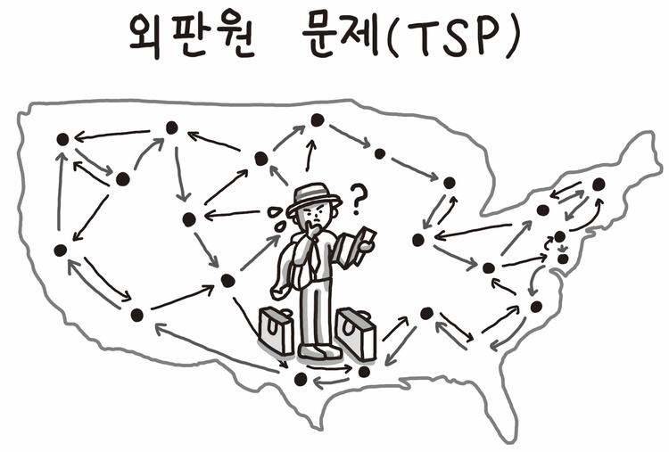

# 외판원 순회 문제(Travelling Salesman Problem)



### 💵 외판원 순회 문제란?

외판원 순회 문제는 **한 정점에서 시작해서 다른 모든 정점을 한 번씩만 방문해서 시작 정점으로 돌아오려 할 때 가능한 최소 비용 및 방문 순서**를 찾는 문제이다.

### 🗒️NOTE

외판원 순회 문제에서는 시작점이 주어질 수도, 그렇지 않을 수도 있지만 어느 경우든 문제가 없다. 최단 순회 경로가 존재한다면 이는 **사이클**을 이룰 것이고, 따라서 어떤 정점으로부터 시작하든 자기 자신으로 돌아오기 위한 **최소 비용은 동일**할 것이기 때문이다. 어떤 정점이든 자신으로 돌아오는 경로 또한 동일한 사이클 안에 있다. 

### ✏️ 풀이(1) 완전 탐색 [[외판원 순회 2](https://www.acmicpc.net/problem/10971)]

가장 먼저 생각해 볼 수 있는 풀이법은 가능한 방문 순서를 고려해 모두 확인해보는 것이다.

N개의 정점과 간선의 정보가 주어졌다고 해보자. 이 N개의 정점에 대해 가능한 방문 순서는 당연히 N!이 될 것이다. 하지만 앞서 말한 것과 같이 어떤 정점으로부터 시작하든 최단 순회 경로는 항상 동일할 것이다. 따라서 시작 정점은 임의로 지정해줘도 되고, 우리가 탐색해야 할 것들은 나머지 N-1개 정점의 순서이다. 즉 외판원 순회 문제는 (N-1)!의 시간 복잡도 내에 풀 수 있다.


0~4번 정점들이 있고, 그 간선 정보들 또한 주어졌다고 하자. 이때 0번 정점을 임의로 시작 정점으로 지정한다면, 남은 일은 나머지 정점들로 순열을 만들고 주어진 간선 0→1, 1→2, 2→3, 3→4, 4→0들의 길이를 확인하는 것 뿐이다.

 

%2057c1615f337f45caa12f7349bdb668ab/Untitled%202.png)

이를 마지막 순열까지 반복한다면 가능한 모든 경우들을 고려한 것이므로 답을 찾을 수 있다.

문제는 11!(=39916800) 정도까지는 완전 탐색으로 풀어볼 만하지만, 12!(=479001600)부터는 완전 탐색을 적용할 수 없다는 것이다.

---

### ✏️ 풀이(2) DP [[외판원 순회](https://www.acmicpc.net/problem/2098)]

완전 탐색으로 풀 수 있는 것보다 좀 더 큰 경우에는 DP를 이용해 풀 수 있다. 기본적인 아이디어는 DFS로, 현재 방문 중인 정점, 이때까지 방문한 정점 및 최소 비용을 알고 있을 때, 방문 가능한 미방문 정점들을 방문해보는 것이다. 여기서 정보들은 비트마스킹을 이용해 dp 배열에 다음과 같이 저장된다.

                 **dp[방문 중인 정점][현재까지 방문한 정점들] = 최소 비용**

- 왜 **비트 마스킹**을 이용하는지?
    
    비트 연산은 다음의 이점을 가진다.
    
    - 1) 빠른 속도
    - 2) 적은 메모리
    - 3) **멋**

* 만약 비트마스킹을 사용하지 않고 위의 방문 배열을 만든다면 다음과 같이 만들 수도 있을 것 같다.

**dp[16][2][2][2][2]…[2][2][2][2]**

혹은 key-value 값으로??

자세한 건 코드를 통해서 

```cpp
//N은 정점의 개수, W[a][b]는 a->b의 간선이다.
//dp[16][1<<16] : 정점의 개수는 최대 16개.

int N, W[16][16], dp[16][65536]{ 0, };
int main() {
	scanf("%d", &N);
	for (int i = 0; i < N; i++) {
		for (int j = 0; j < N; j++) scanf("%d", &W[i][j]);
	}
	printf("%d", TSP(0, 1));
	//0번째 정점을 시작 정점으로 생각하자.
	//시작 정점인 0번 정점이 방문됐으니 0번째 비트를 1로 만든다.
}
```

---

```cpp
//아래는 일반적인 DFS와 유사하다.
int TSP(int cur, int visited) {
	if (visited == (1 << N) - 1) {//(1 << N) - 1이면 모든 N개의 정점이 방문되었다는 것이다.
		if (W[cur][0]) return W[cur][0]; //이 경우, 시작 정점으로 돌아가는 간선이 있다면 반환하고
		else return INF; //없다면 무한대를 반환한다.
	}
	
  /*
		int ret이 아니라 int &ret을 쓰는 이유는?
		여기서 변경되어야 할 값은 dp[cur][visited]이기 때문이다.
    쉽게 말해 dp[cur][visited]를 일일이 쓰지 않고 ret으로 줄여쓰기 위함이라 생각해도 좋다.
	*/
	int &ret = dp[cur][visited]; //현재 정점까지, visited의 정점들을 거쳐서 온 최솟값이
	if (ret) return ret; //있다면 그것을 반환하고,
	
	ret = INF; //없다면 아직 방문을 하지 않은 경우이므로 무한대를 넣어준다.

	for (int i = 0; i < N; i++) {//모든 정점들에 대해
		if (!W[cur][i]) continue; //현재 정점에서 갈 수 없는 정점이거나
		if (visited & (1 << i)) continue; //이미 방문한 정점이라면 패스한다.
		ret = min(ret, TSP(i,visited|(1<<i)) + W[cur][i]);
	  //그렇지 않으면 해당 정점으로 가는 간선을 더하면서 해당 정점에 방문하면서 최솟값을 갱신해나간다.
	}
	return ret;
}

```
