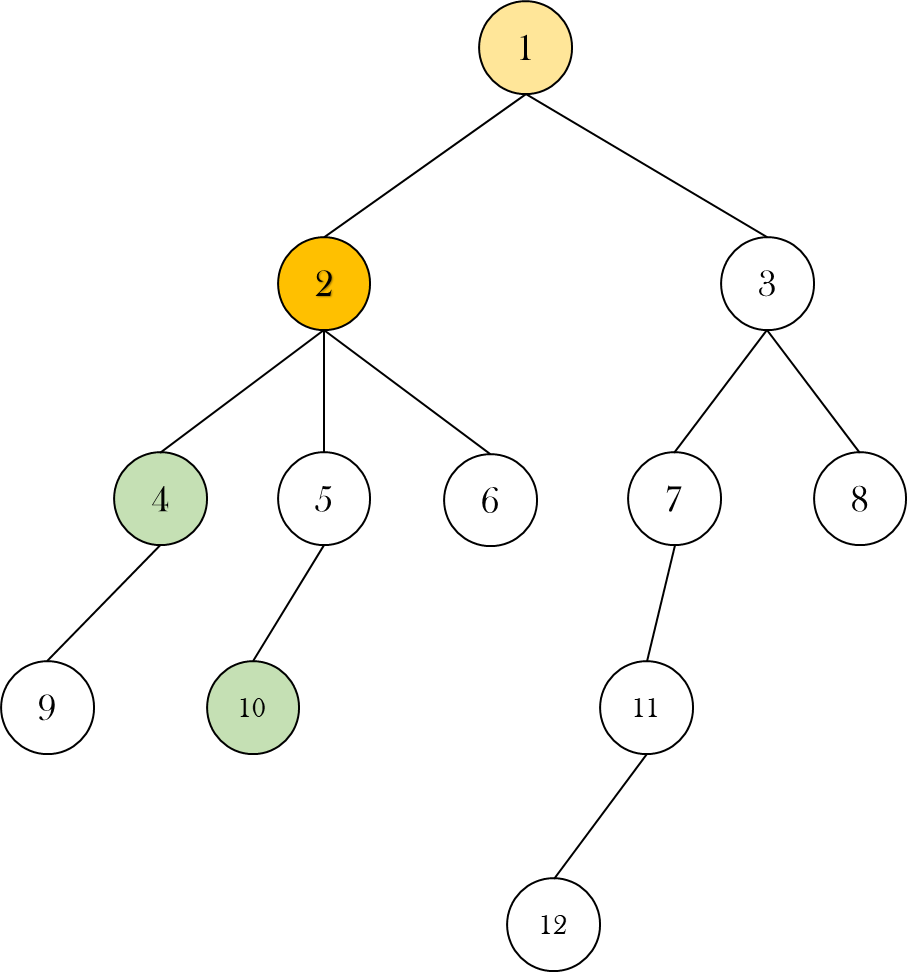

# 조합론, 그래프
태그: LCA, Permutation

# 최소 공통 조상(Lowest Common Ancestor, LCA)

이런 트리가 주어졌을 때, 4번, 10번 노드의 **공통 조상**들에는 2번, 1번 노드가 있다.



이 중 가장 아래에 있는 ******2번 노드******를 가리켜 4번, 10번 노드의 **최소 공통 조상**(LCA)이라고 한다.

---

## LCA 알고리즘 (1) (문제 :  [가장 가까운 공통 조상](https://www.acmicpc.net/problem/3584))

(**i**) 간선 정보가 주어질 때, 각 노드의 깊이와 해당 노드의 부모 노드를 저장하며 트리를 만든다.


(ii) 최소 공통 조상을 구해야 하는 두 노드가 주어지면 우선 두 노드의 깊이를 확인한다.


(iii) 만약 두 노드의 깊이가 서로 다르다면 좀 더 깊이 있는 노드를 루트 방향으로 거슬러 올라가면서 두 노드의 깊이를 맞추어 준다.


(iv) 만약 여전히 두 노드가 서로 다르다면 두 노드가 서로 같은 노드가 될 때까지 둘을 모두 위로 올려본다.


(v)  언젠가 두 노드가 서로 같은 노드가 된다면 그 노드가 입력된 두 노드의 최소 공통 조상이 된다.


위 트리의 최대 깊이를 $d$라고 할 때, 위 알고리즘의 시간 복잡도는 $O(d)$가 된다.

```cpp
int findLSA(int u, int v){
	if (depth[u] < depth[v]) swap(u, v); // 좀 더 깊이 있는 노드를 선택한다.

	while (depth[u] != depth[v]) {       // 두 노드의 깊이가 서로 같아질 때까지 더 깊이 있는 노드의 조상을 찾아보자
		u = parent[u]; 
	}
	while (u != v){                      // 깊이가 서로 같음에도 두 노드가 서로 다르다면
		u = parent[u];                     // 이번에는 두 노드를 함께 위로 올려준다.
		v = parent[v];                     // 두 노드는 언제나 루트 노드의 자손들이므로 이 과정이 끝나지 않는 경우는 발생하지 않는다.
	}
	return u;                            // 최소 공통 조상을 리턴
}
```

---

## LCA 알고리즘 (2) Sparse Table (문제 : [LCA 2](https://www.acmicpc.net/problem/11438))

위의 **LCA 알고리즘(1)**의 시간 복잡도가 $O(d)$($d$는 트리의 최대 깊이)라면, 노드가 아주 많이 주어지는 경우에는 어떻게 될까?

만약 트리의 균형이 깨져 다음과 같은 트리가 만들어졌다고 해보자


여기에서 1번 노드와 9,223,372,036,854,775,807$(=2^{63}-1)$번 노드의 공통 조상을 찾기 위해서 위 **LCA 알고리즘(1)**을 사용한다면 반드시 시간 초과에 빠지게 될 것이다. 다행히 노드가 꽤 많이 주어지는 경우에도 특정 두 노드의 최소 공통 조상을 $\log d$의 시간에 찾아낼 수 있는 방법이 있다. 

(**i**) 알고리즘의 전체적인 맥락은 첫 번째 알고리즘과 동일하지만, 1차원 배열에 자신의 **부모 노드**만을 저장했던 첫 번째와는 달리 이번에는 **2차원 배열에 자신의 $2^i$번째 조상을 저장한다.(이를 가리켜 Sparse Table이라 함)**

 


즉 parent[j]에는 j번 노드의 1, 2, 4, 8, 16, … 번째 조상이 무엇인지가 저장되어 있다.

(i**i**) 이번에도 5번, 12번 노드의 LCA를 찾아보자


12번 노드가 더 깊이 있으므로 이번에도 5번 노드와 같은 높이로 올려줘야 한다.

만약 12번 노드의 3번째 부모를 찾으려면 어떻게 해야할까? 3을 이진수로 나타내면 $11_{(2)}$이므로 12번 노드의 3번째 부모를 찾으려면 12번 노드의 $2^0$번째 조상의 $2^1$번째 조상을 찾으면 된다. 즉 12번 노드의 $n$ 번째 조상을 찾으려면 $n$의 0번째, 1번째, …. 비트를 돌면서 1인 비트 자리($k$)를 찾아서 $2^k$번째 조상을 찾아나가면 된다. 

배열 `parent[12]` 에는 12번 노드의 $2^0, 2^1,...$번째 조상들이 저장되어있으니 이를 보면서  $n$번째 조상을 찾을 수 있다.

5번 노드와 12번 노드의 깊이의 차이는 2이고 이를 2진수로 나타내면 $10_{(2)}$이다. 바로 $2^1$번째 조상을 찾아가자

```cpp
if (depth[a] < depth[b]) swap(a, b);
	int diff = depth[a] - depth[b];				// 두 노드의 깊이 차이

	for (int i = 0; i < MAX_DEPTH; i++){
		if (diff & (1 << i)) a = parent[a][i];		// 깊이 차이만큼 올려주기
	}
}
```


(i**ii**) 두 노드의 높이를 맞췄는데 두 노드가 서로 다른 노드라면 이번에는 둘을 함께 올려주면 된다. 어떻게 올릴 수 있을까? 

아래와 같은 트리가 있고 8번, 9번 노드의 LCA를 구하고 싶다고 하자. 


이 트리에서 확인할 수 있는 것은 8, 9번의 LCA인 5번 노드의 조상 노드들은 모두 8, 9번 노드의 공통 조상 노드이기도 하다는 것이다. 

따라서 8, 9번 노드와 LCA까지의 깊이 차이를 $d$라고 할 때, 다음과 같은 두 경우가 있을 수 있다.

1) 만약 8번 노드의 $2^i$번째 노드와 9번 노드의 $2^i$번째 노드가 동일하다면, $d \leq 2^i$이다. 

2) 한편 8번 노드의 $2^i$번째 노드와 9번 노드의 $2^i$번째 노드가 동일하지 않다면, $d > 2^i$가 될 것이다.

만약 두 번째 경우라면, 8, 9번 노드는 각각 $2^i$만큼 위로 올려 줘도 괜찮다. 이를 반복하면 두 노드는 두 노드의 최소 공통 조상의 정확히 아래에 위치하게 된다. (즉 $d-1$번째 조상!)

```cpp
if (a != b) {
	for (int j = MAX_DEPTH - 1; j >= 0; j--) {			// 조상들을 보면서
		if (parent[a][j] && parent[a][j] != parent[b][j]) {	// 2^j 조상이 있고, 그것들이 서로 다른 경우
			a = parent[a][j];				// 두 노드는 2^j만큼 위로 올려줘도 좋다.
          		b = parent[b][j];                                   
		}
	}
	a = parent[a][0];						// 이 두 노드가 LCA의 정확히 아래에 위치하므로 그 부모를 찾으면 그 노드가 바로 LCA이다.
}
```

## LCA 알고리즘 (3) Euler Tour Technique

[오일러 투어](https://en.wikipedia.org/wiki/Euler_tour_technique)를 이용해서 LCA를 찾아보자


위 트리의 정점들을 오일러 투어로 방문한 순서대로 저장하면 다음과 같은 길이 $2 N-1$의 배열을 얻을 수 있다.


5번 노드와 12번 노드의 LCA를 찾으려고 한다면 배열 `node` 에서 5와 12가 가장 먼저 등장하는 구간에서 depth가 가장 작은 노드(여기서 답은 1)를 찾으면 된다.


주어진 특정 구간에서 최솟값을 찾을 때에는 세그먼트 트리를 쓰면 되고 그 시간 복잡도는 $O(\log N)$이다.
