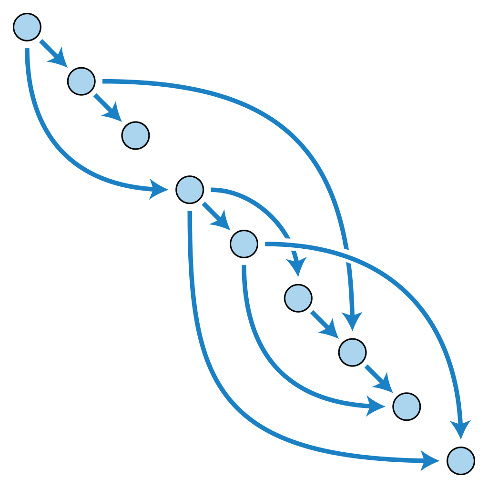

# Topological sort
---

## DAG(Directed Acyclic Graph)
<br>

- DAG는 사이클이 없는 방향(유향) 그래프이다.

- 트리는 DAG에 속한다. (DAG는 루트가 여러개일 수 있다.)

- DAG를 구성하는 작업(Vertex)들의 특징은 선, 후 관계를 가지는것 이다.

DAG의 예시로는 선수강 과목, 작업 순서 등 순서가 있고 Acyclic한 트랜잭션을 표현할 수 있다.

<br>

## Topological sort

선/후 관계만 표현되어있는 업무들을 순서대로 배치하기 위해 위상 정렬을 한다. 선/후 관계가 위배되지 않도록 정렬하기 때문에, 다양한 해를 가질 수 있다.



위상 정렬에는 2 가지 방법이 있다.

1. 진입 차수와 BFS - Queue
2. DFS - Stack
 
두 알고리즘 모두 간선과 노드만큼 반복하여 시간복잡도가 O(V + E) 이다.

<br>

### Topological Sort - BFS

가장 앞에 두어야할 노드는 진입하는 간선이 없는 노드가 되어야 한다. 즉 진입 차수(in-degree)가 0인 놈을 기준으로 정렬해나가는 개념이다.

---
- 사전에 진입 차수를 구해 놓는다.
- 다음 반복
   1. 진입 차수 0인 노드를 Queue에 넣는다. 
       - 정답 Array에 저장한다.

   2. cur(pop in Queue)에서 진출되는 노드들의 진입 차수를 줄여준다. (진입 차수 0을 만드는 행위.)
---

코드로 구현하면 다음과 같다.

```python 
from collections import deque

ans = []
v, e = map(int, input().split())
in_degree = [0] * (v + 1)
graph = [[] for _ in range(v + 1)]
queue = deque()

for i in range(e):
    a, b = map(int, input().split())
    graph[a].append(b)
    in_degree[b] += 1   # 진입 차수를 저장하자.

for i in range(1, v + 1):
    if in_degree[i] == 0:
        queue.append(i) # 진입 차수 0인 것들을 queue에 삽입.

while queue:
    cur = queue.popleft()
    ans.append(cur)

    for node in graph[cur]:
        in_degree[node] -= 1    # 정렬된 노드에 대한 정보를 지운다.
        if not in_degree[node]:
            queue.append(node)

print(ans)
```

<br>

### Topological Sort - DFS


위상 정렬된 그래프를 보면, 임의의 중간 노드에서 끝까지 위상정렬되어 있는 부분 집합으로 볼 수 있다.
임의의 노드로 DFS를 진행하며 위상 정렬하고, 방문하지 않은 노드로 다시 DFS하는데, 선행 노드로 취급하여 앞에다 두면 된다.

가장 깊은 놈을 stack에 넣고 빠지면서
stack의 LIFO를 생각하면 쉽게 구현할 수 있다.

---
다음 반복
  - 방문하지 않은 임의의 노드를 선택한다.
  - 노드를 기준으로 DFS를 하는데, __깊은 곳에서 나오면서__ stack에 넣는다. (깊은 놈이 먼저 들어가게)
  - 모두 방문했다면, stack을 역순으로 뒤집는다.
  
(DFS를 할 때, 재귀나 stack중 편한 것을 사용하면 된다. stack을 쓸 경우 기존 stack과 구분하여 사용해야 한다.)

---


코드로 구현하면 다음과 같다.

```python 

# 재귀를 이용한 DFS
def dfs_recursive(v):
    visited[v] = 1
    for node in graph[v]:
        if not visited[node]:
            dfs_recursive(node)
    # 가장 깊이 들어간 후, 나오면서 stack에 적재.
    stack.append(v)


# 스택을 이용한 DFS
def dfs_stack(v):
    tmp = [v]

    while tmp:
        cur = tmp[-1]
        visited[cur] = 1
        for node in graph[cur]:
            if not visited[node]:
                tmp.append(node)
                break
        else:
            # 들어갈 곳이 없을 때, 나오면서 넣어준다.
            cur = tmp.pop()
            stack.append(cur)
        
ans = []
v, e = map(int, input().split())
visited = [0] * (v + 1)
graph = [[] for _ in range(v + 1)]
stack = []

for i in range(e):
    s, e = map(int, input().split())
    graph[s].append(e)


for node in range(1, v + 1):
    if not visited[node]:
        # 둘 중 하나를 고르면 된다.
        dfs_recursive(node)
        dfs_stack(node)

while stack:
    ans.append(stack.pop())

print(ans)
```
