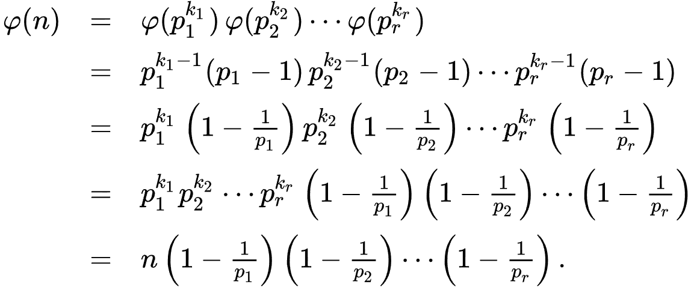

# Prime Number

## 소수 판별 알고리즘

특정 정수 N 이 주어졌을 때, 소수인지 여부를 판별하고자 한다. 몇 가지 방법을 정리해보자. 

### 0. Brute Force

가장 쉬운 방법은 N을 1 부터 N - 1 까지 나누어 보는 것이다. 직관적이지만 매우 오래 걸린다. 

### 1. Square Root

N이 a, b  (a < b)  로 나누어 진다고 가정해보면, 다음이 성립한다.

$$a < \sqrt N < b $$
<br>
 
$$18: 1, 2, 3, 6, 9, 18 $$ 
$$ \sqrt N = 4.xx $$
<br>

$$36: 1, 2, 3, 4, 6, 9, 12, 18, 36 $$
$$ \sqrt N = 6 $$

$\sqrt N$ 보다 작은 수만 탐색해 보면 된다. 
- 시간 복잡도: $O(logN)$
<br><br>


---
## 에라토스 테네스의 체

- N의 소수 판별뿐만 아니라, N보다 작은 소수를 찾고 싶다면?

다음과 같은 방법을 통해 합성수를 걸러나가자.

- n - 1개 정수 리스트 할당.
- 2의 배수 모두 제거
    - 다음 최소값을 선택하고, 배수를 모두 제거 (2 다음은 3)
    - $\sqrt N$ 까지 반복

- 시간 복잡도: $O(N log(logN))$
[시간 복잡도](https://medium.com/@chenfelix/time-complexity-sieve-of-eratosthenes-fb0184da81dc)

```python
import math

n = 1000 
arr = [True for i in range(n + 1)] 
for i in range(2, int(math.sqrt(n)) + 1): 
    if arr[i] == True: 

        j = 2 
        while i * j <= n:
            arr[i * j] = False
            j += 1

for i in range(2, n + 1):
    if arr[i]:
        print(i, end=' ')

```

## 오일러 피

오일러 피 함수는 n이하의 자연수 중 n과 서로소인 수의 개수를 구하는 함수이다. 다음 4가지 식을 이해하면(외우거나) 서로소의 개수를 구하기 편하다.

소수 p와 자연수 a에 대해,

$$ φ(p) = p - 1$$ 

$$ φ(p^a) = p^a - p^{a-1} = p^a(1-{1\over p}) $$ 

서로소 n, m에 대해

$$ φ(mn) = φ(m)φ(n)$$

따라서 소수 p, q와 자연수 a, b에 대해

$$ φ( p^a q^b) = (p^a - p^{a-1})(q^b - q^{b-1}) = p^a(1-{1\over p})q^b(1-{1\over q}) $$

<br><br>

>간단하게 해석하면, n이하의 자연수 중 n과 서로수인 수의 개수는 n을 구성하는 소인수의 연산으로 정의할 수 있다는 것이다.
- $ n = p_1^{k_1}p_2^{k_2}...p_r^{k_r} $ 일 때,




```python 
op = N
for i in range(2, int(N**0.5) + 1):
    if N % i == 0:
        while N % i == 0:
            N //= i
 
        op -= op / i
 
if N > 1:
    op -= op / N

```