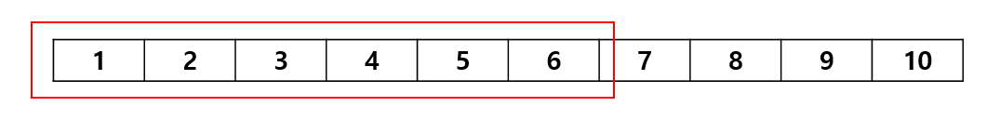
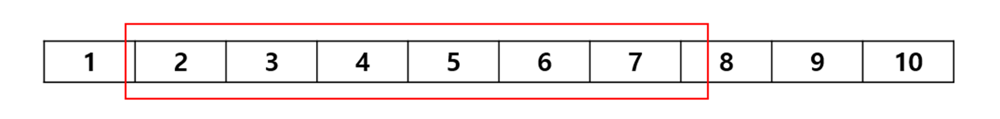
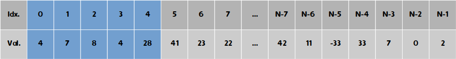
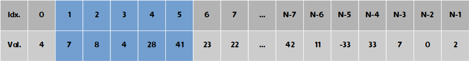
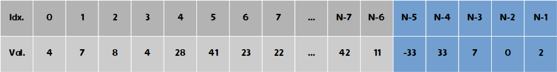
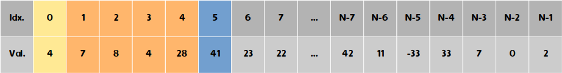
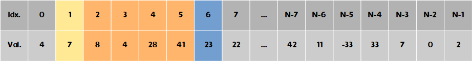
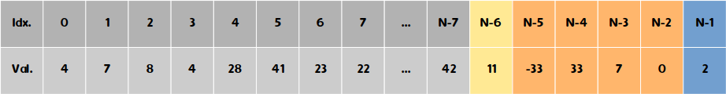

# Sliding Window

- 고정된 크기의 window를 옮기는 알고리즘




- 예제 1
    
    

N, K를 입력 받고 N개의 정수를 입력 받습니다. (0 ≤ K ≤ N ≤ 100,000)

연속하는 K개의 정수의 합의 최댓값을 출력해봅시다. (단 K개 정수의 합은 int의 범위를 넘어가지 않는다고 가정)

```cpp
/*
	풀이 1
*/
#include <iostream>
using namespace std;
#define ans 2147483647

int N, K, ans = INF, sum;
int arr[100000];
int main(){
	scanf("%d%d", &N, &K);
	for (int i = 0; i < N; i++) scanf("%d", &arr[i]);
	for (int i = 0; i <= N - K; i++) {
		sum = 0;
		for (int j = 0; j < K; j++) {
				sum += arr[i + j];
		}
		if (ans > sum) ans = sum;
	}
	printf("%d", ans);
}
```

풀이 1의 경우 매 index마다 연속된 K개 정수의 합을 구하면서 최솟합을 찾습니다. 따라서 시간복잡도는 O(N*K)가 됩니다.





(…)



```cpp
/*
풀이 2
*/
#include <iostream>
using namespace std;

int N, K, ans, sum;
int arr[100000];
int main(){
	scanf("%d%d", &N, &K);
	for (int i = 0; i < N; i++) scanf("%d", &arr[i]);
	for (int i = 0; i < K; i++) {
		ans += arr[i];
		sum += arr[i];
	}

	for (int i = 1; i <= N - K; i++){
		sum -= arr[i-1];
		sum += arr[i + (K - 1)];
		if (ans > sum) ans = sum;
	}

	printf("%d", ans);
}
```





(…)

   
주황색 부분은 공통된 부분이므로 그대로 두고, 노란색은 빼고 파란색은 더해 가면서 연속된 구간의 합을 구합니다. 매번 구간 내 배열 요소들을 모두 더하면서 합을 구하는 것이 아니기 때문에 시간복잡도는 O(N)입니다.
